eureka源码学习
2020年5月12日16:23:41

[TOC]

## eureka client初始化流程

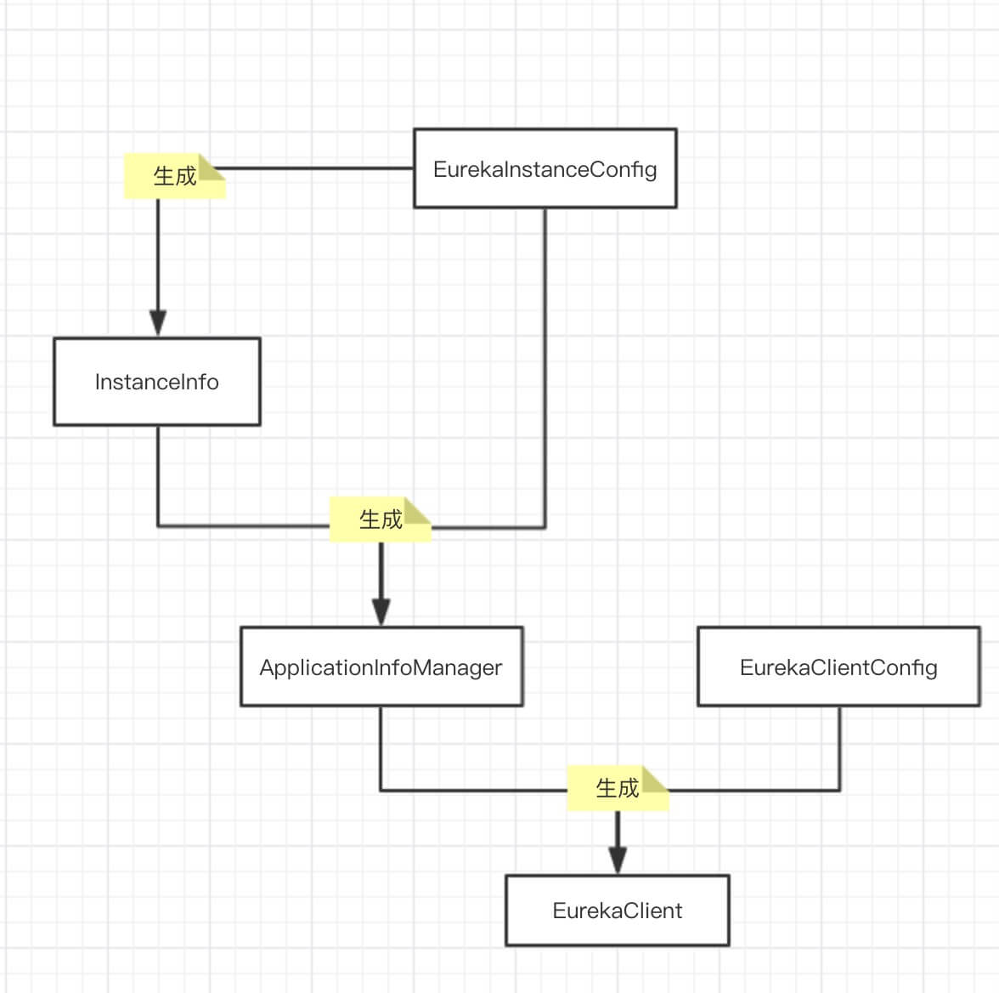

- 创建 EurekaInstanceConfig对象
- 使用 EurekaInstanceConfig对象 创建 InstanceInfo对象
- 使用 EurekaInstanceConfig对象 + InstanceInfo对象 创建 ApplicationInfoManager对象
- 创建 EurekaClientConfig对象
- 使用 ApplicationInfoManager对象 + EurekaClientConfig对象 创建 EurekaClient对象

### instance-client-config

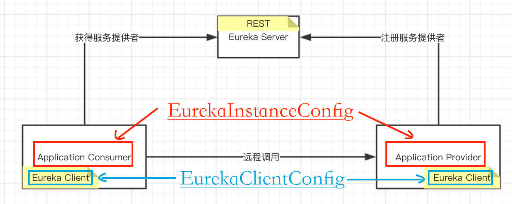

### EurekaInstanceConfig类关系

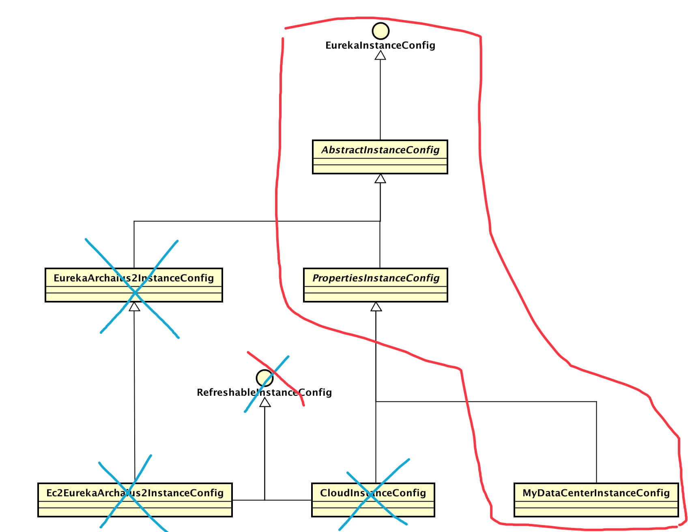

### EurekaClientConfig类图

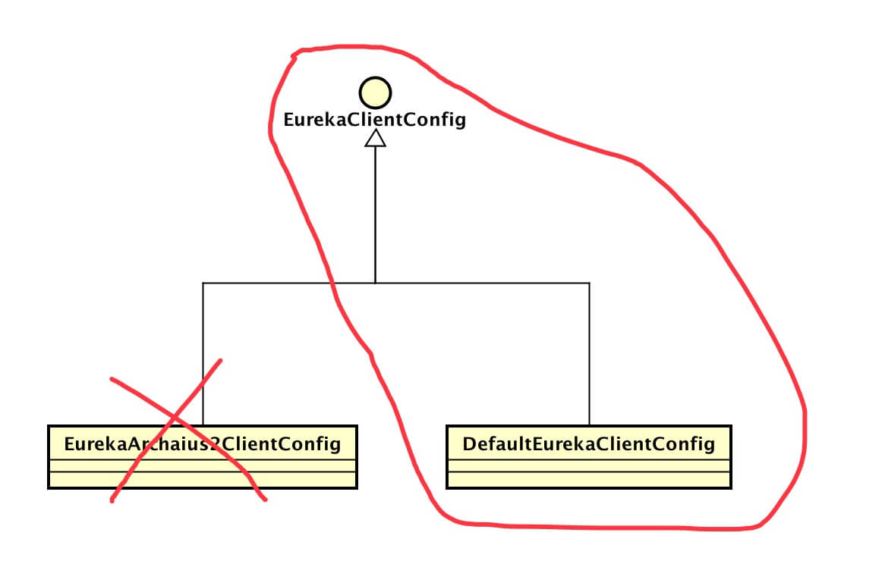

### Region和Availability Zone概念

Region和Availability Zone均是AWS的概念：

- Region表示AWS中的地理位置，例如us-east-1、us-east-2、eu-west-1等。
- 每个Region都有多个Availability Zone，彼此内网打通。
- 各个Region之间完全隔离，彼此内网不打通。
- AWS通过这种方式实现了最大的容错和稳定性。

spring cloud 默认是 us-east-1 。

- 非AWS环境下，可将将Region理解为内网没有打通的机房。
- 将Availability Zone理解成相同机房的不同机架（内网打通）。

### 配置eureka.instance.prefer-ip-address = true

配置 `eureka.instance.prefer-ip-address = true` 就可以将IP注册到Eureka Server上，Spring会自动为我们获取第一个非回环IP地址。
而如果不配置就是机器的主机名。

`eureka.instance.ip-address` 和 `eureka.instance.prefer-ip-address = true` 同时设置，会用自动获取的ip还是手动设置的？
用手动配置的。

### appname

应用名称，会自动转大写，使用 `eureka.instance.appname` 配置。
可以用 `spring.application.name` 代替，优先级高于 `eureka.instance.appname` 。

### eureka.instance.instanceId 实例id

默认值 `${spring.cloud.client.hostname}:${spring.application.name}:${spring.application.inst}`，即 机器主机名:应用名称:应用端口 。

配置 `eureka.instance.hostname` 可以指定注册的主机名。

### LookupService、EurekaClient、DiscoveryClient

继承关系：
LookupService -> EurekaClient -> DiscoveryClient

LookupService：查找服务接口，提供单一的方式获取应用集合，获取可用的实例

EurekaClient：简单的接口，用于服务发现client

- 提供多种方法获取应用集合和应用实例信息集合
- 提供方法获取本地客户端信息，例如，应用管理器 ApplicationInfoManager 和 Eureka-Client 配置 EurekaClientConfig
- 提供方法注册本地客户端的健康检查和 Eureka 事件监听器

DiscoveryClient：服务发现客户端

- 向 Eureka-Server 注册自身服务
- 向 Eureka-Server 续约自身服务
- 向 Eureka-Server 取消自身服务，当关闭时
- 从 Eureka-Server 查询应用集合和应用实例信息

## eureka server 初始化流程

EurekaServerConfig -> DefaultEurekaServerConfig，eureka server的默认配置。

Eureka-Server 启动入口 EurekaBootStrap。
在 Servlet 容器( 例如 Tomcat、Jetty )启动时，调用 #contextInitialized() 方法，初始化 Eureka-Server。

Eureka-Server 内嵌 Eureka-Client，用于和 Eureka-Server 集群里其他节点通信交互。

### PeerAwareInstanceRegistryImpl

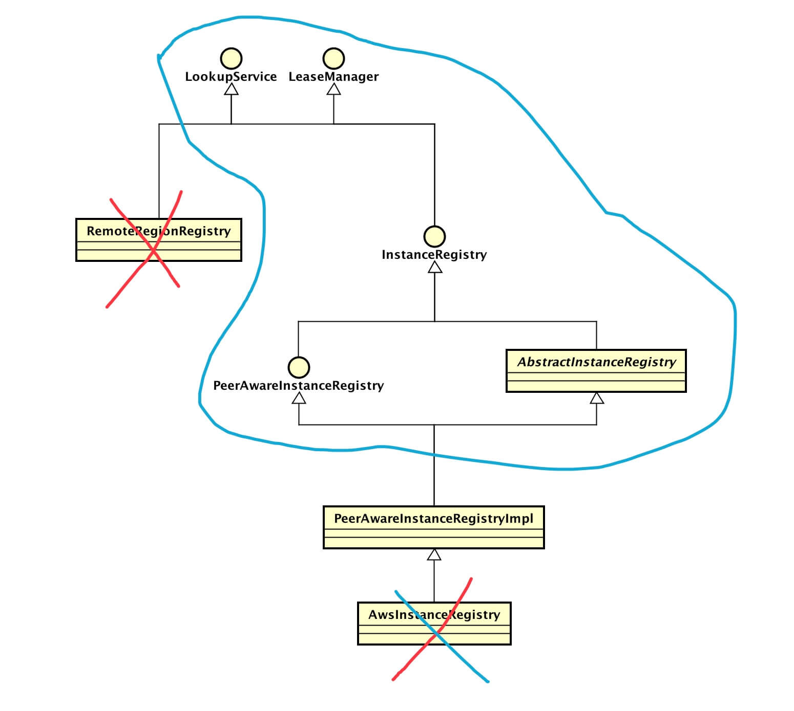

Eureka-Server 过滤器( javax.servlet.Filter ) 顺序如下：

- StatusFilter：Eureka-Server 状态过滤器。当 Eureka-Server 未处于开启( InstanceStatus.UP )状态，返回 HTTP 状态码 307 重定向。
- ServerRequestAuthFilter：Eureka-Server 请求认证过滤器。Eureka-Server 未实现认证。目前打印访问的客户端名和版本号，配合 Netflix Servo 实现监控信息采集。
- RateLimitingFilter：请求限流过滤器
- GzipEncodingEnforcingFilter：gzip压缩编码过滤器
- ServletContainer：Jersey MVC 请求过滤器

## Eureka-Client 向 Eureka-Server 注册应用实例的过程

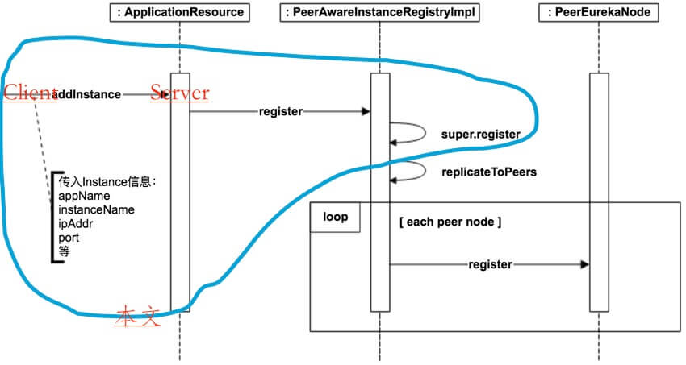

Eureka-Client （DiscoveryClient）向 Eureka-Server 发起注册应用实例需要符合如下条件：

- 配置 `eureka.registration.enabled = true`，Eureka-Client 向 Eureka-Server 发起注册应用实例的开关。
- InstanceInfo 在 Eureka-Client 和 Eureka-Server 数据不一致。
- 每次 InstanceInfo 发生属性变化时，标记 isInstanceInfoDirty 属性为 true，表示 InstanceInfo 在 Eureka-Client 和 Eureka-Server 数据不一致，需要注册。
- 另外，InstanceInfo 刚被创建时，在 Eureka-Server 不存在，也会被注册。

当符合条件时，InstanceInfo 不会立即向 Eureka-Server 注册，而是后台线程定时注册。

当 InstanceInfo 的状态( status ) 属性发生变化时，并且配置 `eureka.shouldOnDemandUpdateStatusChange = true` 时，立即向 Eureka-Server 注册。
因为状态属性非常重要，一般情况下建议开启，当然默认情况也是开启的。

DiscoveryClient 注册流程：

- 一堆参数的初始化，初始化心跳定时任务，刷新定时任务。
- 进行第一次拉取注册信息，拉取失败从备份注册中心拉取。
- 如果开启了启动时立即注册，则直接在主线程中注册，注册失败直接在构造函数抛出异常。
- 初始化心跳，拉取，同步定时任务。
  - 延迟执行拉取定时任务。
  - 延迟执行心跳定时任务。
  - 初始化同步实力信息的定时任务。
  - 初始化并注册状态改变监听器。
  - 启动第一次同步复制。
    - 设置为数据不同步状态。
    - 启动延迟定时任务，设置定时任务引用。
    - 定时任务：
      - 刷新当前的实例信息，包括：hostName、ipAddr、dataCenterInfo、租期过期时间、租期续约频率。
      - 如果信息有改变，设置isDirty为true。
      - 进行状态健康检查。
      - 调用监听器，如果状态又改变了，取消当前的定时任务，重新执行一遍。
      - 获取信息改变时间，如果不为空，执行**注册**，重置状态改变时间。
- 初始化完成，设置一些变量，比如初始化时间。

com.netflix.eureka.resources.ApplicationResource，处理单个应用的请求操作的 Resource ( Controller )：

- 参数id校验，校验不通过返回400
- 向注册表中注册
  - 向注册表中注册
    - 保证内存map注册表不为空
    - 获取可能存在过的注册信息，如果已存在过的是比较新的，采用已注册的
    - 添加最近注册的到一个队列，供UI页面使用
    - 设置重写状态，并根据指定的规则获取最终的重写状态
    - 设置服务上线，动作为添加，添加到最近改变队列中，用于增量获取
    - 设置实例的最后更新时间
    - 清理缓存
  - 向其他节点同步
- 返回204

## Eureka-Client 向 Eureka-Server 续租应用实例的过程

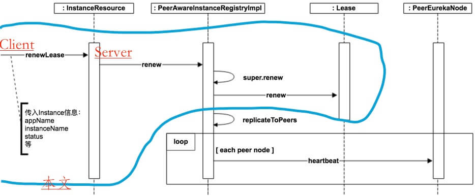

Eureka-Client 向 Eureka-Server 发起注册应用实例成功后获得租约 ( Lease )。 
Eureka-Client 固定间隔向 Eureka-Server 发起续租( renew )，避免租约过期。
默认情况下，租约有效期为 90 秒，续租频率为 30 秒。两者比例为 1 : 3 ，保证在网络异常等情况下，有三次重试的机会。

Eureka-Client 在初始化过程中，创建心跳线程，固定间隔向 Eureka-Server 发起续租( renew )

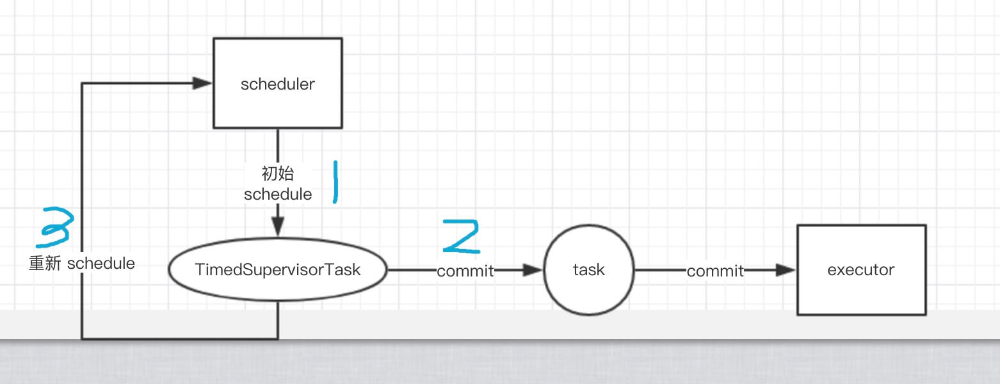

心跳任务控制：

- 上层 scheduler 初始化延迟执行 TimedSupervisorTask。
- TimedSupervisorTask 执行时，提交实际心跳任务 task 到实际执行的 executor 执行任务。
- 当 task 执行正常，TimedSupervisorTask 再次提交自己到scheduler 延迟 timeoutMillis 执行。
- 当 task 执行超时，重新计算延迟时间( 不允许超过 maxDelay )，再次提交自己到scheduler 延迟执行。

com.netflix.eureka.resources.InstanceResource，处理单个应用实例信息的请求操作的 Resource ( Controller )，接收心跳续约请求。

- 更新最终状态，续约时间，续约速率统计
- 复制信息向其他节点
- 校验client最后修改时间
  - 比服务端的大，返回404，重新注册
  - 比服务端的小，来自其他节点，返回矛盾409
  - 比服务端的小，来自于client，返回200
  
## Eureka-Client 向 Eureka-Server 下线应用实例的过程

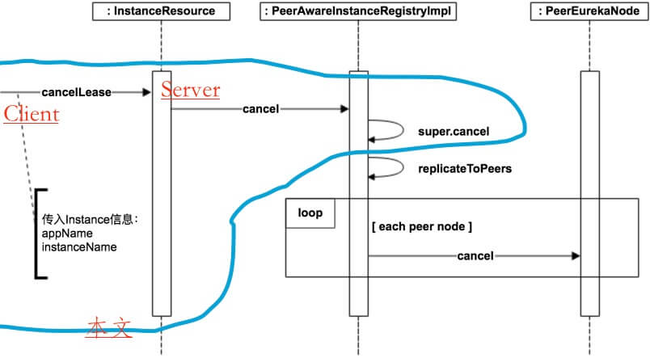

应用实例关闭时，Eureka-Client 向 Eureka-Server 发起下线应用实例。需要满足如下条件才可发起：

- 配置 `eureka.registration.enabled = true` ，应用实例开启注册开关。默认为 false 。
- 配置 `eureka.shouldUnregisterOnShutdown = true` ，应用实例开启关闭时下线开关。默认为 true 。

com.netflix.eureka.resources.InstanceResource，处理单个应用实例信息的请求操作的 Resource ( Controller )，接收服务下线请求。

## 涉及自我保护机制

更新时机：

- server启动
- 服务注册
- 服务下线
- 定时剔除任务

## Eureka-Server 过期超时续租的租约

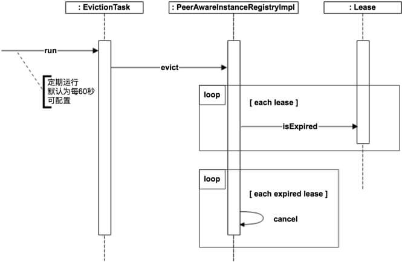

正常情况下，应用实例下线时候会主动向 Eureka-Server 发起下线请求。
但实际情况下，应用实例可能异常崩溃，又或者是网络异常等原因，导致下线请求无法被成功提交。
介于这种情况，通过 Eureka-Client 心跳延长租约，配合 Eureka-Server 清理超时的租约解决上述异常。

## Eureka-Client 向 Eureka-Server 获取全量注册信息的过程

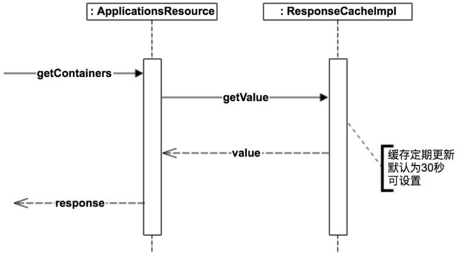

Eureka-Client 获取注册信息，分成全量获取和增量获取。
默认配置下，Eureka-Client 启动时，首先执行一次全量获取进行本地缓存注册信息，而后每 30 秒增量获取刷新本地缓存( 非“正常”情况下会是全量获取 )。

com.netflix.eureka.resources.ApplicationsResource，处理所有应用的请求操作的 Resource ( Controller )，处理全量请求拉取。

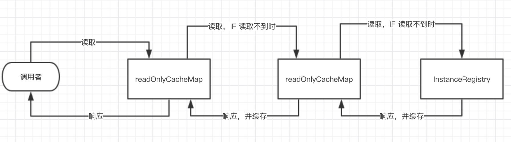

在 ResponseCacheImpl 里，将缓存拆分成两层 ：

- 只读缓存( readOnlyCacheMap )
- 固定过期 + 固定大小的读写缓存( readWriteCacheMap )

缓存过期策略如下：

- 应用实例注册、下线、过期时，只过期 readWriteCacheMap 。
- readWriteCacheMap 写入一段时间( guava可配置 )后自动过期。
- 定时任务对比 readWriteCacheMap 和 readOnlyCacheMap 的缓存值，若不一致，以前者为主。通过这样的方式，实现了 readOnlyCacheMap 的定时过期。

## Eureka-Client 向 Eureka-Server 获取增量注册信息的过程

增量获取注册的应用集合( Applications ) 时，Eureka-Client 会获取到：

- Eureka-Server 近期变化( 注册、下线 )的应用集合
- Eureka-Server 应用集合一致性哈希码
- Eureka-Client 将变化的应用集合和本地缓存的应用集合进行合并后进行计算本地的应用集合一致性哈希码。
  - 若两个哈希码相等，意味着增量获取成功；
  - 若不相等，意味着增量获取失败，Eureka-Client 重新和 Eureka-Server 全量获取应用集合。

Eureka 比较应用集合一致性哈希码，和日常我们通过哈希码比较两个对象是否相等类似。

哈希码计算公式： appsHashCode = ${status}_${count}_
使用每个应用实例状态( status ) + 数量( count )拼接出一致性哈希码。
若数量为 0 ，该应用实例状态不进行拼接。状态以字符串大小排序。

举个例子，8 个 UP ，0 个 DOWN ，则 appsHashCode = UP_8_ 。8 个 UP ，2 个 DOWN ，则 appsHashCode = DOWN_2_UP_8_ 。

com.netflix.eureka.resources.ApplicationsResource，处理所有应用的请求操作的 Resource ( Controller )，#getContainers() 用于接收增量获取请求。

## 任务批处理

Eureka-Server 集群通过任务批处理同步应用实例注册实例。

包括以下内容：

- 任务分发器 TaskDiapatcher，创建接收器、执行器、处理器
- 任务接收器 AcceptorExecutor，单线程执行，从两个队列中拿取任务，放到单个或批量的待处理队列中
- 任务执行器 TaskExecutor，单个或批量，从待处理队列中拉取任务，进行执行，执行失败可重试的放到重新执行队列中
- 任务处理器 TaskProcess，实际执行任务
- 任务持有者( 任务 )

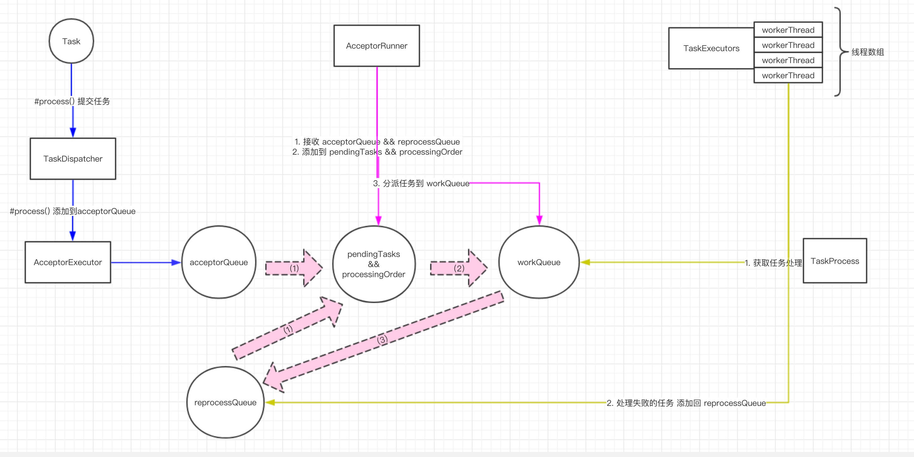

不同于一般情况下，任务提交了立即同步或异步执行，任务的执行拆分了三层队列：

- 第一层，接收队列( acceptorQueue )，重新处理队列( reprocessQueue )。
  - 分发器在收到任务执行请求后，提交到接收队列，任务实际未执行。
  - 执行器的工作线程处理任务失败，将符合条件的失败任务提交到重新执行队列。
- 第二层，待执行队列( processingOrder )
  - 接收线程( Runner )将重新执行队列，接收队列提交到待执行队列。
- 第三层，工作队列( workQueue )
  - 接收线程( Runner )将待执行队列的任务根据参数( maxBatchingSize )将任务合并成批量任务，调度( 提交 )到工作队列。
  - 执行器的工作线程池，一个工作线程可以拉取一个批量任务进行执行。

三层队列的好处：

- 接收队列，避免处理任务的阻塞等待。
- 接收线程( Runner )合并任务，将相同任务编号( 是的，任务是带有编号的 )的任务合并，只执行一次。
- Eureka-Server 为集群同步提供批量操作多个应用实例的接口，一个批量任务可以一次调度接口完成，避免多次调用的开销。

当然，这样做的前提是合并任务，这也导致 Eureka-Server 集群之间对应用实例的注册和下线带来更大的延迟。
毕竟，Eureka 是在 CAP 之间，选择了 AP。

## EndPoint与解析器

EndPoint 服务端点。例如，Eureka-Server 的访问地址。
EndPoint 解析器，将配置的 Eureka-Server 的访问地址解析成 EndPoint 。

目前有多种 Eureka-Server 访问地址的配置方式，只看 Eureka 1.x 的配置：

- 直接配置实际访问地址。例如，`eureka.serviceUrl.defaultZone=http://127.0.0.1:8761` 。
- 基于 DNS 解析出访问地址。例如，`eureka.shouldUseDns=true` 并且 `eureka.eurekaServer.domainName=eureka.rqma.com`

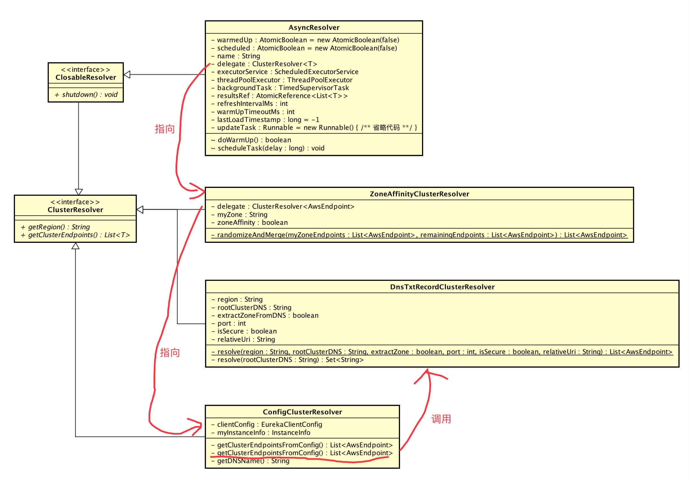

## Eureka的网络通信部分

在不考虑 Eureka 2.x 的兼容的情况下，Eureka 1.x 主要两部分的网络通信：

- Eureka-Client 请求 Eureka-Server 的网络通信
- Eureka-Server 集群内，Eureka-Server 请求 其它的Eureka-Server 的网络通信

对于 Eureka-Server 来说，调用 JerseyReplicationClient#createReplicationClient() 静态方法即可创建用于 Eureka-Server 集群内，Eureka-Server 请求 其它的Eureka-Server 的网络通信客户端。

对于 Eureka-Client 来说，分成用于注册应用实例( registrationClient )和查询注册信息( newQueryClient )的两个不同网络通信客户端。在 DiscoveryClient 初始化时进行创建。

## Server集群同步

Eureka-Server 是允许同一时刻允许在任意节点被 Eureka-Client 发起写入相关的操作，网络是不可靠的资源。
Eureka-Client 可能向一个 Eureka-Server 注册成功，但是网络波动，导致 Eureka-Client 误以为失败。
此时恰好 Eureka-Client 变更了应用实例的状态，重试向另一个 Eureka-Server 注册，那么两个 Eureka-Server 对该应用实例的状态产生冲突。

再例如...... 我们不要继续举例子，网络波动真的很复杂。我们来看看 Eureka 是怎么处理的。

应用实例( InstanceInfo ) 的 lastDirtyTimestamp 属性，使用时间戳，表示应用实例的版本号。
当请求方( 不仅仅是 Eureka-Client ，也可能是同步注册操作的 Eureka-Server ) 向 Eureka-Server 发起注册时，
若 Eureka-Server 已存在拥有更大 lastDirtyTimestamp 该实例( 相同应用并且相同应用实例编号被认为是相同实例 )，
则请求方注册的应用实例( InstanceInfo ) 无法覆盖注册此 Eureka-Server 的该实例( 见 AbstractInstanceRegistry#register(...) 方法 )。

例如我们上面举的例子，第一个 Eureka-Server 向 第二个 Eureka-Server 同步注册应用实例时，不会注册覆盖，
反倒是第二个 Eureka-Server 同步注册应用到第一个 Eureka-Server ，注册覆盖成功。
因为 lastDirtyTimestamp ( 应用实例状态变更时，可以设置 lastDirtyTimestamp 为当前时间，见 ApplicationInfoManager#setInstanceStatus(status) 方法 )。

但是光靠注册请求判断 lastDirtyTimestamp 显然是不够的，因为网络异常情况下时，同步操作任务多次执行失败到达过期时间后，
此时在 Eureka-Server 集群同步起到最终一致性最最最关键性出现了：Heartbeat 。
因为 Heartbeat 会周期性的执行，通过它一方面可以判断 Eureka-Server 是否存在心跳对应的应用实例，另外一方面可以比较应用实例的 lastDirtyTimestamp 。

当满足下面任意条件，Eureka-Server 返回 404 状态码：

- Eureka-Server 应用实例不存在。
- Eureka-Server 应用实例状态为 UNKNOWN。
- 请求的 lastDirtyTimestamp 更大。

请求方接收到 404 状态码返回后，认为 Eureka-Server 应用实例实际是不存在的，重新发起应用实例的注册。

Eureka 通过 Heartbeat 实现 Eureka-Server 集群同步的最终一致性。

## 令牌桶算法

eureka基于令牌桶算法实现限速。

令牌桶算法的原理是系统会以一个恒定的速度往桶里放入令牌，而如果请求需要被处理，则需要先从桶里获取一个令牌，当桶里没有令牌可取时，则拒绝服务。

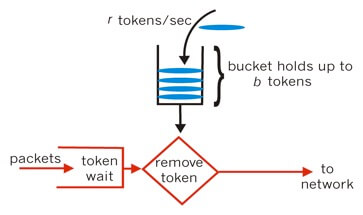

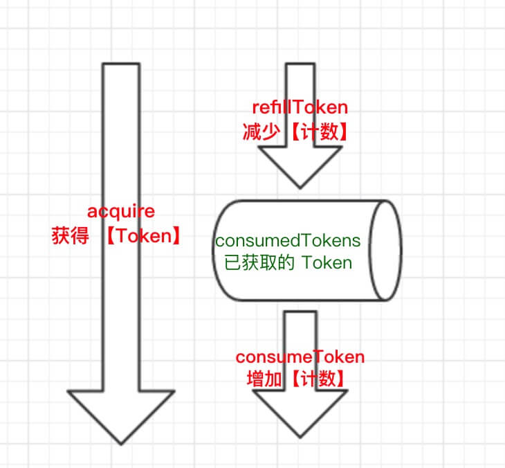

在 `#onDemandUpdate()` 方法，调用 RateLimiter#acquire(...) 方法，获取令牌。

- 若获取成功，向 Eureka-Server 发起注册，同步应用实例信息。
- 若获取失败，不向 Eureka-Server 发起注册，同步应用实例信息。这样会不会有问题？答案是不会。
  - InstanceInfoReplicator 会固定周期检查本地应用实例是否有没向 Eureka-Server ，若未同步，则发起同步。
  - Eureka-Client 向 Eureka-Server 心跳时，Eureka-Server 会对比应用实例的 lastDirtyTimestamp ，若 Eureka-Client 的更大，则 Eureka-Server 返回 404 状态码。Eureka-Client 接收到 404 状态码后，发起注册同步。